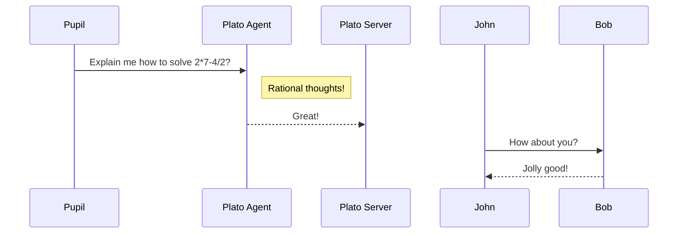

<h1 align="center"> Plato </h1> 
<h3>Unlock the Power of Problem-Solving! </h3>
<h4 align="center">
Empower young minds with our cutting-edge generative AI service, offering step-by-step solutions to math and logic puzzles. From basic arithmetic to complex problem-solving, Plato provides kids with personalized guidance, sparking curiosity and fostering a love for learning. Watch them excel, one solution at a time! 
</h4>
 
 
 
<kbd>
 
</kbd>

## Background
Empower young minds with our cutting-edge generative AI service, offering step-by-step solutions to math and logic puzzles. From basic arithmetic to complex problem-solving, [Plato](https://github.com/dimastatz/plato) provides kids with personalized guidance, sparking curiosity and fostering a love for learning. Watch them excel, one solution at a time! 

## 🔍 At glance

## ❓ FAQ

