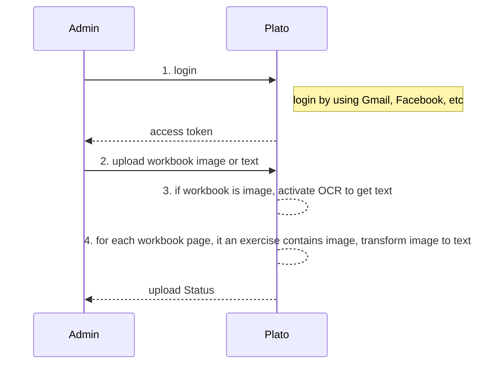
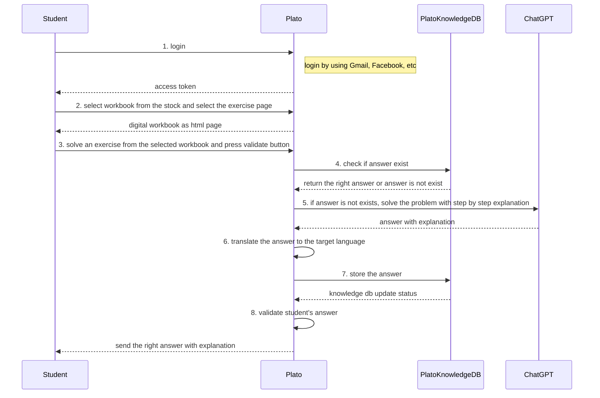

<h1 align="center"> Plato </h1> 
<h3>Unlock the Power of Problem-Solving! </h3>
 
 
<kbd>
 
</kbd>

 
 

# System Design Document
June 2023

## Background
The purpose of this requirements document is to outline the key features, functionalities, and performance expectations for an AI Tutor system Plato targeting elementary school kids. Plato aims to provide an interactive and personalized learning experience, fostering academic growth and engagement.

## Requirements

### Functional Requirements

#### Actors and Actions
1. Admin/Teacher/Parent
    - Login
    - Scan and upload workbooks
    - View Analytics

2. Student
    - Login
    - Ask a question using voice / text commands
    - Choose a question from a pre-existing database of workbooks
    - Solve questions
    - Request a step-by-step solution even when the provided solution is incorrect. 

3. AI Tutor aka Plato
    - Answer question by using internal knowledge DB
    - Answer question by using the ChatGPT prompting
    - Show answers in text
    - Play aloud answers

#### Flows
1. Upload Workbook

##### Question
- <i>Some assignments contain image as part of an assignment description. How we translate an image to text. Can chatGPT explain images. Is it an idea for the product?</i>

2. Solve Exercise from Stock

### Non-Functional Requirements
Address the following aspects of System Design
- Security
- Efficiency
- Capacity
- Scalability
- Reliability
- Maintainability

## System APIs
Reduce Complexity

## High-Level Design
Define components and data flows 

## Detailed Design 
Low-Level design of each component (OOD can help)

## Analysis
- Cost
- Security
- Reliability
- Performance Efficiency
- Operation Excellence

