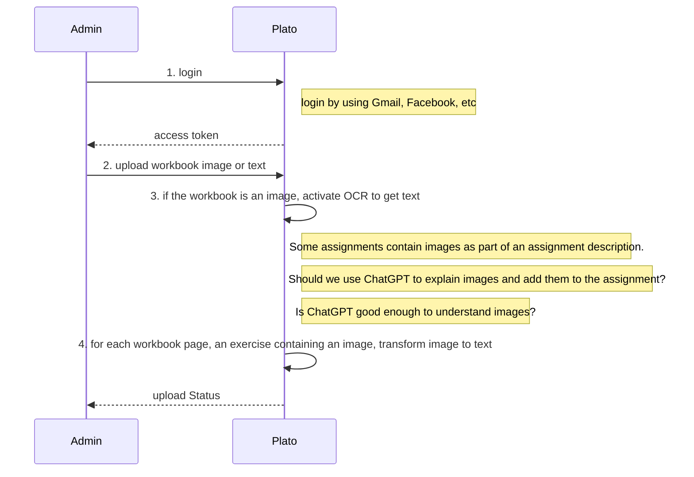
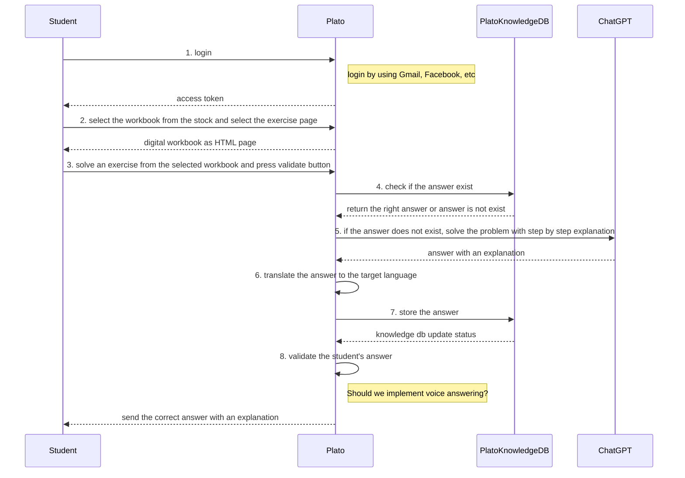
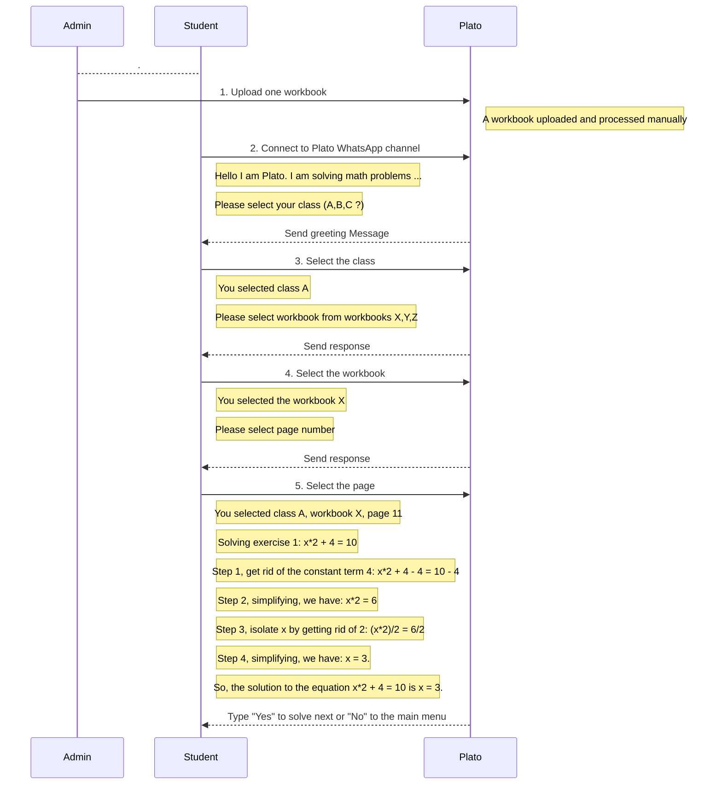
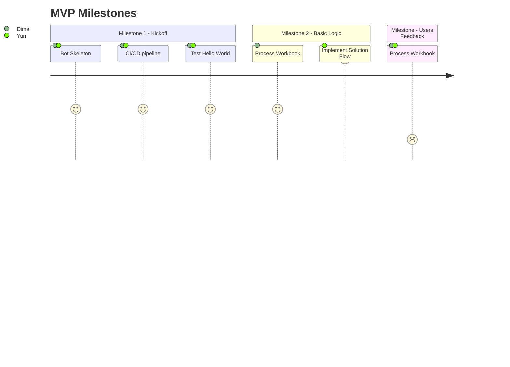

<h1 align="center"> Plato </h1> 
<h3>Unlock the Power of Problem-Solving! </h3>
 
 
<kbd>
 
</kbd>

 
 

# System Design Document
June 2023

## Background
This requirements document outlines the key features, functionalities, and performance expectations for an AI Tutor system Plato targeting elementary school kids. Plato aims to provide an interactive, personalized learning experience, fostering academic growth and engagement.

## Requirements

### Functional Requirements

#### Actors and Actions
1. Admin/Teacher/Parent
    - Login
    - Scan and upload workbooks
    - View Analytics

2. Student
    - Login
    - Ask a question using voice/text commands
    - Choose a question from a pre-existing database of workbooks
    - Solve questions
    - Request a step-by-step solution even when the provided solution is incorrect. 

3. AI Tutor aka Plato
    - Answer questions by using internal knowledge DB
    - Answer questions by using the ChatGPT prompting
    - Show answers in text
    - Play-aloud answers

#### Flows
1. Upload Workbook

2. Solve Exercise from Stock

3. View Analytics
[TBD]

#### MVP Flow
Plato MVP flow is a limited-functionality WhatsApp chatbot for the Plato Service. Developing an MVP enables testing and validating the core concept, taking an iterative approach, and refining the tutor based on user feedback.

### Non-Functional Requirements
Address the following aspects of System Design
- Security
- Efficiency
- Capacity
- Scalability
- Reliability
- Maintainability

## System APIs
Reduce Complexity

## High-Level Design
Define components and data flows 

## Detailed Design 
Low-Level design of each component (OOD can help)

## Analysis
- Cost
- Security
- Reliability
- Performance Efficiency
- Operation Excellence

## Appendix 1 - MVP Milestones

